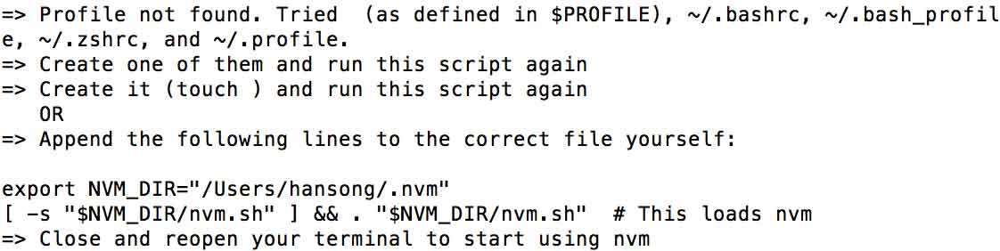
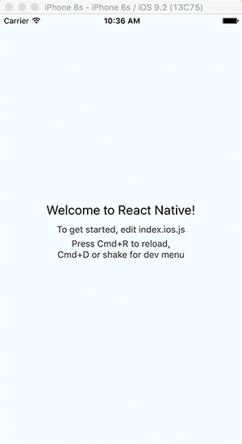
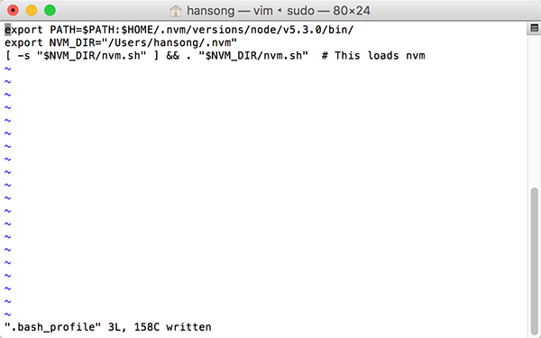

---
layout: post  
title: OS X 下 React Native 开发环境配置
categories: react-native
tags: react-native ios  
--- 
  
#### 系统需求  
- 1) OS X － 假定我们在苹果系统下面开发  
- 2) [Homebrew](http://brew.sh)  苹果系统的apt-get，方便我们安装 *Watchman* 和 *Flow* 
	+ 执行 *ruby -e "$(curl -fsSL https://raw.githubusercontent.com/Homebrew/install/master/install)"* 安装Homebrew 
- 3) [Node.js](https://nodejs.org)4.0或者更高版本 
	+ 执行 *wget -qO- https://raw.githubusercontent.com/creationix/nvm/v0.29.0/install.sh \| bash* 安装nvm。然后执行 nvm install node && nvm alias default node,此命令安装最新版本的node.js,并设置终端命令（node）。用nvm你可以安装多个版本的node.js，并能轻松转换版本。
	+ 执行命令*npm install -g npm@2*安装npm，这儿安装的是npm 2，因为如果你的node.js版本是5.0或者更高版本的话，建议你安装npm 2，它比npm 3 要快多了。
	+ 不知道什么是[npm?](https://docs.npmjs.com)
- 4) 执行 *brew install watchman* 安装[watchman](https://facebook.github.io/watchman/docs/install.html)，建议安装。 
- 5) 如果你想使用[flow](http://www.flowtype.org)，执行 *brew install flow*进行安装

- *建议：定期执行 *brew update* 和 *brew upgrade*，以保持应用程序在最新状态*
- *注意：OS X系统中默认没有bash配置文件，因此安装nvm时可能会因为找不到bash的Profile而会引起失败，如下图*  

解决方法: **sudo vim ~/.bash_profile** 创建并打开profile文件，这时候文件应该是空白的，把*export NVM_DIR="/Users/hansong/.nvm"
[ -s "$NVM_DIR/nvm.sh" ] && . "$NVM_DIR/nvm.sh"  # This loads nvm*（所有斜体部分）添加到.bash_profile文件中去。然后按esc键使vim编辑器回到命令行模式，输入**:wq**存储文件并退出vim。重启终端即可运行nvm命令了。
- *如果安装Node.js慢的话，可以尝试国内的镜像，比如[淘宝的镜像](http://npm.taobao.org)，执行如下命令：NVM_NODEJS_ORG_MIRROR=http://npm.taobao.org/mirrors/node nvm install node*	 

#### iOS 
- 需要Xcode7.0或者更高版本，可以在AppStore中下载。

#### Android
- 需要安装Android SDK。

#### 快速开始
- npm install -g react-native-cli
- react-native init AwesomeProject

	耐心等待，这个过程中会在网上下载很多文件，因为网络原因还可能经常出错，这个是没办法的事儿。
	这样我们就创建了一个AwesomeProject的工程，既有iOS也有Android。

**如何在iOS上面运行这个工程呢**  

- cd AwesomeProject/iOS
- 双击打开AwesomeProject.xcodeproj,运行此工程

	如果你比较幸运，那么在等待不算短的时间的编译后，您的模拟器上会出现这个界面

	但是，往往我们并没有那么幸运，Xcode在编译这个工程前会先运行两个脚本，一个是packager.sh，一个是react-native-xcode.sh。那么问题来了，此过程中会出现诸如："node: command not found", "react-native: command not found"等问题，究其原因就是找不到这些程序。
	
	如何解决呢，还记得我们创建的那个 ~/.bash_profile文件吗，打开它（比如用vim），在前面加上
	**export PATH=$PATH:$HOME/.nvm/versions/node/v5.3.0/bin/**，node和react-native 这两个程序都在这个目录下面。修改完之后的.bash_profile文件如图：
	
	当然，如果你的node版本不是5.3.0，请自己查询并修改为正确的路径。
	
	然后打开 react-native-xcode.sh ，在最前面加上**source ~/.bash_profile**。
	再编译运行，应该就没什么错误了。
	

到此我们的环境就算是搭完了，接下来就是开始一步步学习react-native了。

